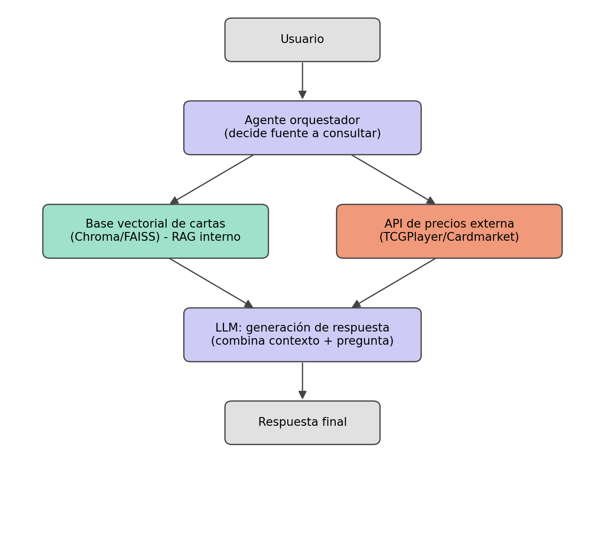

# Pokémon TCG RAG — Evolving Skies

Agente con recuperación aumentada (RAG) que responde consultas sobre las cartas del
set **Evolving Skies** de Pokémon TCG, combinando una base de datos vectorial local
(catálogo de cartas) con una herramienta de consulta de precios en tiempo real.

Proyecto desarrollado para la Evaluación Parcial N°1 — ISY0101 Ingeniería de
Soluciones con IA (Duoc UC).

## Arquitectura



1. El usuario hace una consulta en lenguaje natural.
2. El **agente orquestador** (`src/agent.py`) decide si debe buscar cartas en la
   base vectorial, consultar precios externos, o ambos.
3. La **base vectorial** (`src/vector_store.py`, Chroma) recupera las cartas más
   relevantes por similitud semántica.
4. La **herramienta de precios** (`src/tools/price_api.py`) consulta valores de
   mercado en vivo cuando corresponde.
5. El **LLM** combina el contexto recuperado con la pregunta original y genera la
   respuesta final, citando las cartas usadas.

Detalle completo de las decisiones de diseño en el informe técnico entregado junto
a este repositorio.

## Estructura del proyecto

```
pokemon-tcg-rag/
├── README.md
├── requirements.txt
├── .env.example
├── data/                     # catálogo de cartas descargado (se genera al correr ingest.py)
├── docs/
│   └── architecture.png
├── src/
│   ├── config.py             # carga de variables de entorno
│   ├── ingest.py             # descarga cartas y construye la base vectorial
│   ├── vector_store.py       # wrapper de Chroma (indexar / buscar)
│   ├── rag_pipeline.py       # orquesta recuperación + generación
│   ├── agent.py              # decide qué herramienta usar y llama al LLM
│   ├── llm_client.py         # cliente del LLM (Claude / OpenAI, intercambiable)
│   ├── main.py               # punto de entrada por consola (CLI)
│   └── tools/
│       └── price_api.py      # consulta de precios en tiempo real
└── tests/
    └── test_retrieval.py     # prueba básica de la recuperación semántica
```

## Requisitos

- Python 3.10+
- Una API key de un proveedor de LLM (Anthropic o OpenAI) para la etapa de
  generación. La recuperación (embeddings + Chroma) funciona sin API key.

## Instalación

```bash
git clone <url-del-repositorio>
cd pokemon-tcg-rag
python -m venv .venv
source .venv/bin/activate        # Windows: .venv\Scripts\activate
pip install -r requirements.txt
cp .env.example .env             # y completar la API key del LLM
```

## Ejecución

1. **Descargar el catálogo del set y construir la base vectorial** (solo la primera
   vez, o cuando se quiera actualizar el catálogo):

   ```bash
   python -m src.ingest
   ```

   Esto consulta la API pública de Pokémon TCG (https://pokemontcg.io) filtrando por
   el set Evolving Skies (`swsh7`), genera los embeddings de cada carta y los guarda
   en `data/chroma_db/`.

2. **Iniciar el asistente por consola:**

   ```bash
   python -m src.main
   ```

   Ejemplos de consultas a probar:
   - "Busco una carta de tipo Dragón con HP mayor a 200 que tenga una habilidad de curación"
   - "Recomiéndame 3 cartas que complementen a Rayquaza VMAX"
   - "¿Cuál es el precio actual de Umbreon VMAX Alt Art?"

3. **Ejecutar las pruebas:**

   ```bash
   pytest tests/
   ```

## Uso de inteligencia artificial en el desarrollo

Declarar en esta sección, según lo exigido por la pauta de la evaluación, qué
herramientas de IA se usaron durante el desarrollo del código (por ejemplo, apoyo
en la redacción de este README o en la estructura inicial del proyecto) y qué partes
fueron diseñadas, implementadas y validadas directamente por el equipo.

## Evidencia de pruebas

Agregar aquí (o en una carpeta `docs/evidencia/`) capturas de pantalla de consultas
reales ejecutadas contra el sistema, junto con una breve nota de si la respuesta fue
correcta y coherente con los datos recuperados.
